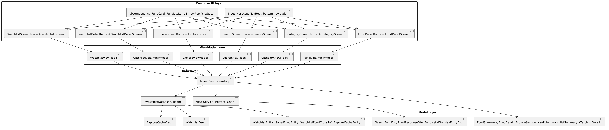

# InvestNest

InvestNest is a Kotlin + Jetpack Compose Android app for exploring mutual funds, reviewing NAV (Net Asset Value) history, and saving funds into custom watchlists.

## What the app includes

- Explore screen with four required categories, `Index Funds`, `Bluechip Funds`, `Tax Saver (ELSS)`, and `Large Cap Funds`
- Progressive category enrichment, the app shows search seeded results first and fills NAV data as detail calls return
- View All screen with one network fetch and a local `visibleCount` loading pattern
- Dedicated search screen with `300ms` debounce
- Fund detail screen with a simple sampled NAV line chart and watchlist action
- Multi folder watchlists backed by Room, so one fund can exist in multiple watchlists
- Explore caching in Room, so cached cards can still show when the device is offline
- Explicit loading, error, and empty states across the main flows
- System light and dark theme support with a green blue visual identity

## Preview


https://github.com/user-attachments/assets/9706567d-6482-425b-8186-5c2cfa5ea7b4


https://github.com/user-attachments/assets/50f704ee-959b-490a-abfc-a0bbe1ecee99


## Tech stack

- Kotlin
- Jetpack Compose
- MVVM
- Hilt
- Retrofit + Gson
- Room
- Kotlin Flow
- Material 3

## Architecture

The app keeps the structure feature first, while the data layer stays shared and small:

- `feature/explore`, `feature/search`, `feature/category`, `feature/detail`, `feature/watchlist`, and `feature/watchlistdetail` hold screen UI and screen specific ViewModels
- `data/remote` contains the MFAPI service and DTOs
- `data/local` contains Room entities, relations, DAOs, and the database
- `data/InvestNestRepository.kt` keeps the remote and local orchestration in one place
- `ui/components` stores reusable Compose pieces like fund cards, list rows, and empty states

## System architecture



### Data flow

#### Explore

1. Read cached explore cards from Room, if available
2. Fetch search results for each category keyword
3. Show seeded cards immediately
4. Fetch latest NAV data per fund in parallel
5. Update cards progressively as data returns
6. Save the enriched section back into Room

#### Search

1. Debounce the query by `300ms`
2. Fetch matching schemes from MFAPI search
3. Show immediate results
4. Fill in latest NAV and category details progressively

#### Watchlists

1. Store folders in Room
2. Store saved funds separately
3. Use a cross reference table so a single fund can belong to multiple folders
4. Save bottom sheet changes in one Room transaction

#### Fund chart

- Full history comes from `https://api.mfapi.in/mf/{scheme_code}`
- History is sorted oldest to newest
- The repository samples it down to roughly `120` points max
- The detail screen filters that sampled list for `6M`, `1Y`, or `ALL`


## Runtime data note

- Runtime fund data is fetched from MFAPI and, where needed, cached in Room.
- User created watchlists are stored in Room.


## API endpoints used

- Search: `https://api.mfapi.in/mf/search?q={query}`
- Latest fund summary: `https://api.mfapi.in/mf/{scheme_code}/latest`
- Full history: `https://api.mfapi.in/mf/{scheme_code}`

## Running the project

1. Open the project in Android Studio
2. Let Gradle sync complete
3. Run the `app` configuration on an emulator or device running Android 10, API 29, or above

### Useful commands

```powershell
./gradlew :app:compileDebugKotlin --console=plain
./gradlew :app:assembleDebug --console=plain
```

## Implementation notes

- The app intentionally uses a simple custom `Canvas` chart instead of a chart library
- View All is not true pagination, it loads once and reveals more rows locally
- The empty state illustration is built in Compose instead of using image assets
- Explore caching is limited to the explore cards because that is the explicit offline requirement in the assignment

## Known build note

The current Android Gradle Plugin setup needed compatibility flags in `gradle.properties` so Kotlin Android, Hilt, and kapt can work together cleanly with this template. The app compiles successfully with that setup.
